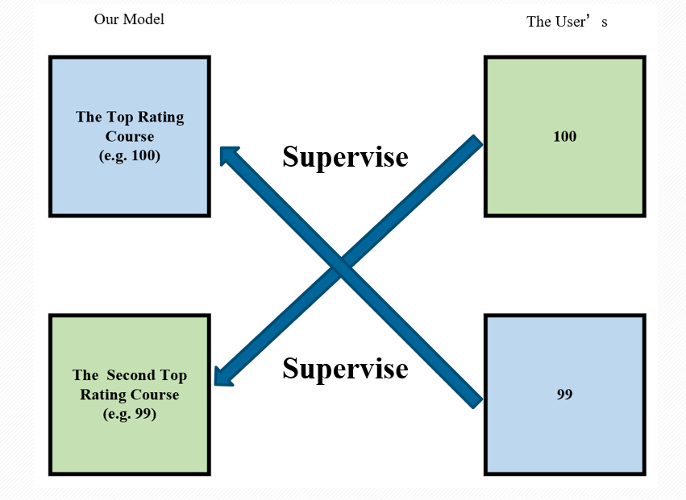

<h1 align="center">
ReCourse(智选课友): An AI-driven Course Timetable Companion for ACEM
</h1>
<p align="center">
  2023 Fall BUSS 3620 人工智能导论大作业
  <br />
  李金昊; 卢其汶; 吴苛铭; 熊栩源; 赵霄宇
  <br />
</p>


这是一款可以帮助安泰同学排课的脚本😊

## Requirements

为了让程序正常运行，你需要安装：

* `python`
* `numpy`
* `PIL`
* `PyPt5`
* `pytorch`

你可以按照如下的操作进行：

* 创建一个虚拟环境并激活：

  ```
  conda create -n ReCourse python=3.11
  conda activte Recourse
  ```

* 安装对应cuda版本的[pytorch](https://pytorch.org/)，例如：

  ```
  pip3 install torch torchvision torchaudio --index-url https://download.pytorch.org/whl/cu118
  ```

* 安装`Pillow`，`Pandas`，`PyQt5`

  ```
  pip install Pillow
  pip install pandas
  pip install PyQt5==5.15.10
  ```
  或者可以按照如下命令一键安装：
  ```
  pip install -r requirements.txt
  ```

## Quickstart

采用如下命令会直接显示出UI窗口：

```
python runner.py
```

用户可以根据自己的需要选择偏好(如喜好的时间，老师等)：


点击`confirm all selections`即可确认输入，等待算法生成课表。

## Update model

本项目的实现基于了一个初始模型，如果想要获得更好的用户体验，可以在运行程序的时候加上参数`is_update`：

```
python runner.py --is_update=True
```

这样课程权重模型可以根据你的反馈进行迭代。

## Algorithm

### Backtrack Search

把本问题建模成了约束满足问题，并采用改良版的回溯搜索进行求解。先找到所有的可行解，再取课表评分进行排序。

默认实现采用了AC3来降低搜索空间，下面对比了naive，forward checking，AC3算法的性能：

| 选课门数 | naive（探索节点数） | forward checking（探索节点数） | AC3（探索节点数） |
| -------- | ------------------- | ------------------------------ | ----------------- |
| n=3      | 217                 | 185                            | **185**           |
| n=5      | 302                 | 266                            | **264**           |
| n=10     | 8504                | 4062                           | **4044**          |

可以看到，forward checking已经能有效减少搜索空间，但是针对n较大或者更加复杂的系统，AC3的表现更佳

### Cross Supervision

更新权重模型时，采用了**交叉监督(原创)**的方法。如果用户需要反馈并更新模型，会根据现在最优和次优课表的评分进行交叉监督。



